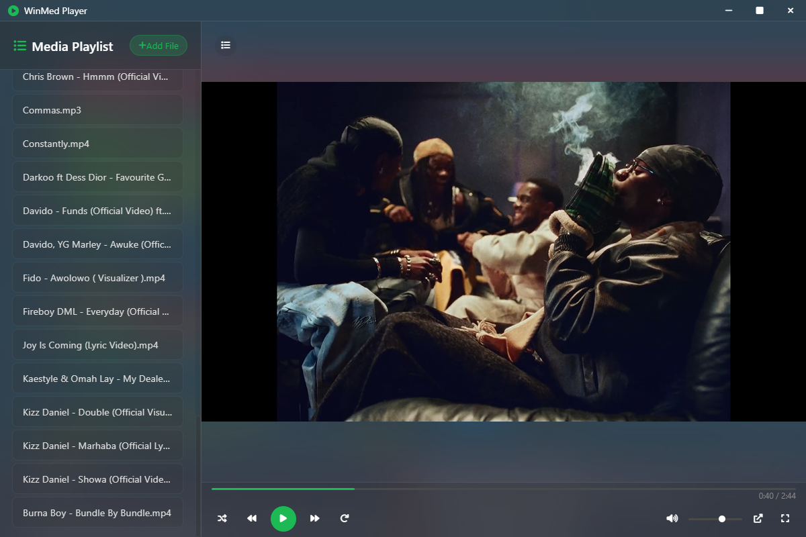

# WinMed - Professional Media Player

A modern, feature-rich media player built with Electron. WinMed provides a sleek, user-friendly interface for playing video and audio files with advanced playback controls.



## Features

- 🎥 Video and Audio Playback
- 📋 Playlist Management
- 🔄 Shuffle and Repeat Modes
- 🖼️ Picture-in-Picture Support
- ⌨️ Keyboard Shortcuts
- 🎨 Modern Dark Theme
- 📱 Responsive Design
- 🖱️ Drag and Drop Support
- 📝 Subtitle Support

### Playback Controls

- Play/Pause
- Previous/Next Track
- Volume Control with Mute
- Progress Bar with Seek
- Fullscreen Mode
- Picture-in-Picture Mode
- Subtitle Display and Control

### Playlist Features

- Add Multiple Files at Once
- Smart Drag and Drop (plays new files immediately)
- Remove Tracks
- Track Selection
- Playlist Toggle

### Subtitle Features

- Support for SRT subtitle files
- External subtitle file loading
- Subtitle visibility toggle
- Automatic subtitle detection

### Keyboard Shortcuts

- `Space` - Play/Pause
- `Left/Right` - Seek -/+ 5 seconds
- `Up/Down` - Volume Control
- `F` - Toggle Fullscreen
- `M` - Toggle Mute
- `Alt + P` - Toggle Picture-in-Picture
- `C` - Toggle Subtitles
- `N` - Next Track
- `P` - Previous Track

## Installation

### Option 1: Using the Installer (Windows)

1.  Download the latest `WinMed-Setup-X.X.X.exe` from the [Releases](https://github.com/samcuxx/WinMed-Media-Player/releases) page (if available).
2.  Run the downloaded installer and follow the on-screen instructions.
3.  During installation, you can choose to associate WinMed with common media file types.

### Option 2: Running from Source

1.  Clone the repository:

```bash
git clone https://github.com/samcuxx/WinMed-Media-Player.git
cd WinMed-Media-Player
```

2.  Install dependencies:

```bash
npm install
```

3.  Start the application:

```bash
npm start
```

### Registering as a Media Player in Windows

To register WinMed as a media player and associate it with media file types:

1.  First, package the application:

```bash
npm run package:win
```

2.  Then register the file associations:

```bash
npm run register-filetypes
```

This will register WinMed with Windows as a media player application and add it to the "Open with" menu for supported file types. You can then set it as the default application for specific media formats through Windows Settings.

## Development

### Prerequisites

- Node.js (v14 or higher recommended)
- npm (v6 or higher recommended)
- [Inno Setup](https://jrsoftware.org/isinfo.php) (v6 or higher recommended, required for creating the Windows installer)

### Building from Source

1.  Clone the repository and navigate into the directory.
2.  Install dependencies:

```bash
npm install
```

3.  To package the application (without creating an installer):

```bash
# For Windows
npm run package:win
# (Add similar scripts for macOS/Linux if needed)
```

    This will create a packaged version of the app in the `release-builds` directory.

4.  To create the Windows installer (requires Inno Setup to be installed and configured):

```bash
npm run create-installer:win
```

    This will first run the `package:win` script and then use Inno Setup to create an installer in the `installers` directory.

### Building for Production

```bash
npm run build
```

## Supported Formats

- Video: MP4, WebM
- Audio: MP3, WAV, OGG
- Subtitles: SRT (converted to VTT internally)

## Contributing

1. Fork the repository
2. Create your feature branch (`git checkout -b feature/AmazingFeature`)
3. Commit your changes (`git commit -m 'Add some AmazingFeature'`)
4. Push to the branch (`git push origin feature/AmazingFeature`)
5. Open a Pull Request

## License

This project is licensed under the MIT License - see the [LICENSE](LICENSE) file for details.

## Acknowledgments

- Built with [Electron](https://www.electronjs.org/)
- Icons by [Font Awesome](https://fontawesome.com/)

## Author

Samuel - [@samcuxx](https://github.com/samcuxx)

## Support

If you like this project, please give it a ⭐️!
